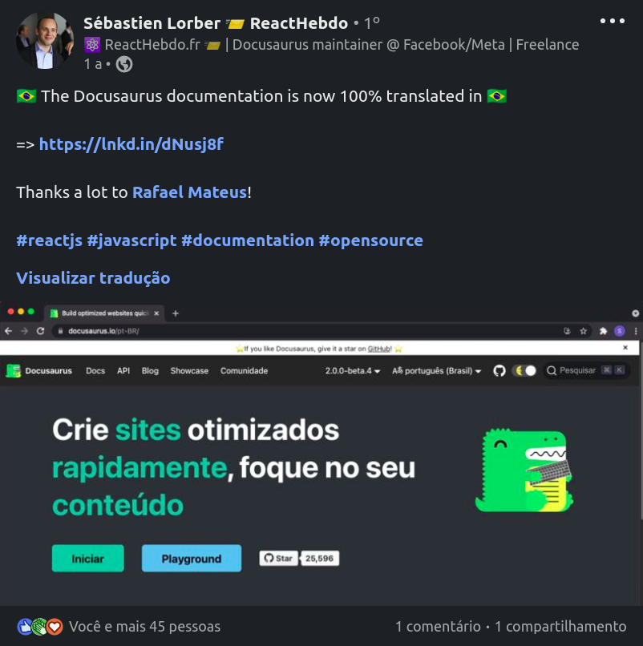

Criando um blog para compartilhar conteúdos de desenvolvimento de software.

> Pensei, pensei, enrolei, testei, desisti e acabei criando um blog...

A ideia é compartilhar conteúdos de desenvolvimento de software
e contextos que estou atuando com outros desenvolvedores.
Já sofri muito para entender coisas tolas no mundo da programação
e gostaria que outras pessoas não tivesse a mesma esperiência.

Ao contrário do que a rapaziada tech fala:
"cara, vou largar tudo e ir vender picolé na praia...",
gosto muito dessa área e acabo criando muitos projetos ou estudando
sobre conteúdos que gostaria de compartilhar.

# Por que criar um blog? 🤔

A ideia inicial era só publicar no [linkedin](https://linkedin.com.br/in/rafaelbmateus)
mas mesmo assim, gostaria de arquivas os materiais em algum lugar para reutilizar.

<!-- truncate -->

Ai criei alguns rascunhos e salvei no Google Docs. No início, tudo certo.

Mas ai pensei...
Ué, vai ficar esses arquivos aqui tudo guardado no drive
sendo que eu posso que eu posso compartilhar de uma maneira organizada.

Então, veio a ideia de criar um blog usando o
[docusaurus](https://docusaurus.io) 💡

# Por que o docusaurus?

A um ano atrás acabei conhecendo o [docusaurus](https://docusaurus.io)
e achei muito massa.
Fiquei surpreso com a simplicidade e funcionalidades de documentação e blog
que vem padrão, sem precisar codificar muito.

A que mais destacou para mim foi a
[documentação com versionamento](https://docusaurus.io/docs/versioning).

Por exemplo, se for criar uma documentação para uma sdk
e essa sdk evoluir e subir de versão, você consegue navegar pelas versões disponíveis.

Outra coisa legal, mas que não é particularmente do docusaurus
é escrever as páginas usando [Markdown](https://www.markdownguide.org).
Fica simples, não precisa programar nada, deixando o foco para o conteúdo.

Acabei gostando tanto do projeto que trabalhei na tradução para pt-br



[Link da publicação](https://www.linkedin.com/posts/sebastienlorber_reactjs-javascript-documentation-activity-6827988344983564288-bTf3)

# Crie o seu!

A documentação do [docusaurus](https://docusaurus.io) é muito boa e fácil de seguir.
Já vem muita configuração padrão.

Para criar o seu blog, site ou expor documentação
[siga o tutorial rápido](https://docusaurus.io/docs#fast-track).

Resumindo seria apenas criar o projeto:

```console
npx create-docusaurus@latest my-website classic
```

E iniciar o site:

```console
cd my-website
npx docusaurus start
```

Aí só abrir o navegador [http://localhost:3000](http://localhost:3000)

Depois você pode fazer o deploy no github pages, sem pagar nada.

# Exemplos

Quando conheci o [docusaurus](https://docusaurus.io),
tinha criado esse [repositório](https://github.com/rafaelbmateus/my-website)
bem simples, só seguindo o tutorial inicial de 5 minutos.

Usei também para uma comunidade que criei com o site e blog
[whiteStone_dev](https://github.com/whitestonedev/website)

Se ficar com dúvida, pode entrar em contato comigo pelo LinkedIn
que tento ajudar também 🤙
